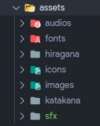

# asset-syncronation README

## Features

Flutter asset syncronation is an extension to generate static variable that contain path of your assets file, so you don't have to remember the path when you need them.

## Usage

Sort your assets files according to the file types by using folder like this

<p float="left">
  
</p>

add `# assets-generator-begin` comment in the begining of assets section and `# assets-generator-end` in the end of section of the `pubspec.yaml` file, don't forget to save the `pubspec.yaml` for automatically update the project or do it manually by run `flutter pub get` on the terminal.

```
assets:
   # assets-generator-begin
   - assets/audios/
   - assets/fonts/
   - assets/icons/
   - assets/images/
   # assets-generator-end
```

everytime you add or delete files/folders in `assets` folder it will automatically generate `r.dart` file contains classes according to the name of the sub folder in assets, the class will look like this

```dart
class AssetAudios {
	static const String countdownFinish = 'assets/audios/countdown_finish.wav';
	static const String countdownStart = 'assets/audios/countdown_start.wav';
	static const String giphy = 'assets/audios/giphy.gif';
	static const String kaiwa1 = 'assets/audios/kaiwa_1.mp3';
	static const String kaiwa10 = 'assets/audios/kaiwa_10.mp3';
	static const String kaiwa2 = 'assets/audios/kaiwa_2.mp3';
	static const String kaiwa3 = 'assets/audios/kaiwa_3.mp3';
	static const String kaiwa4 = 'assets/audios/kaiwa_4.mp3';
	static const String kaiwa5 = 'assets/audios/kaiwa_5.mp3';
	static const String kaiwa6 = 'assets/audios/kaiwa_6.mp3';
	static const String kaiwa7 = 'assets/audios/kaiwa_7.mp3';
	static const String kaiwa8 = 'assets/audios/kaiwa_8.mp3';
	static const String kaiwa9 = 'assets/audios/kaiwa_9.mp3';
	static const String kanas = 'assets/audios/kanas';
	static const String negativeTone = 'assets/audios/negative_tone.mp3';
	static const String positiveTone = 'assets/audios/positive_tone.mp3';
}

class AssetFonts {
	static const String kyokasho = 'assets/fonts/kyokasho.ttf';
}
```

After that you just need to import `r.dart` file, and access the static variable like usual.

## Release Notes

### 1.0.0

- Stable Release
- Generate `r.dart` file automatically everytime there's file added/removed/updated
- Update instruction in README.MD